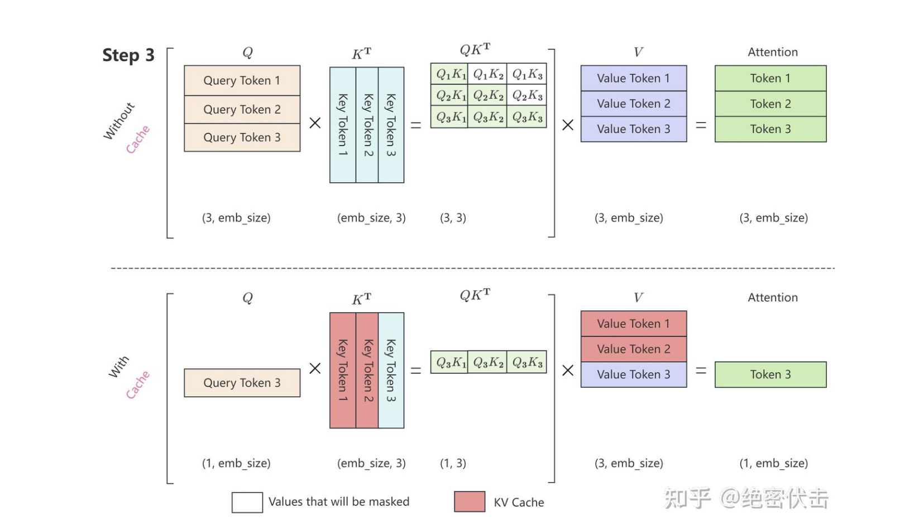

# 算子文档

## rms norm
\(\epsilon\)：极小值（model config里面读取），防止分母为零
\(\gamma \in \mathbb{R}^d\)：缩放权重参数，维度和向量维度相同
   $$\boldsymbol{y} = \frac{\boldsymbol{x}}{\sqrt{\frac{1}{d}\sum_{i=1}^d x_i^2 + \epsilon}} \cdot \boldsymbol{\gamma}$$
在Transformer中作为轻量化归一化手段，替代Layer Norm，消除批次依赖以适配小批量训练，降低计算复杂度的同时稳定各层输入特征的幅值分布。

## Sinusoidal 

设序列中某个token的位置为`pos`（从0开始的整数，如第1个token pos=0，第2个pos=1），模型的embedding维度为`d_model`（通常为偶数，如512、1024），维度索引为`i`（从0到d_model-1）。
Sinusoidal位置编码的第`pos`个位置、第`i`维的取值为：
$$
PE_{(pos, i)} =
\begin{cases}
\sin\left(pos / base^{2i/d_{\text{model}}}\right), & \text{若 } i \text{ 为偶数} \\
\cos\left(pos / base^{2i/d_{\text{model}}}\right), & \text{若 } i \text{ 为奇数}
\end{cases}
$$

### 特性
1. **天然的位置关系隐含**：通过三角恒等变换，能推导出“两个位置的编码向量可线性表示其相对位置”，理论上支持相对位置感知（但效果较弱）；
2. **周期性频率分层特性**：所有每个分量的数值都具有周期性，且越靠后的分量，波长越长，频率越低，高频维度（大`i`）捕捉短距离的位置规律（如单词级的位置差异），低频维度（小`i`）捕捉长距离的位置规律（如句子级的位置差异）
3. **远程衰减**: 对于两个相同的词向量，如果它们之间的距离越近，则他们的内积分数越高，反之则越低，因此具备一定的长度外推能力

### 缺点
1. **长序列建模能力差**：当序列长度远超训练时的长度（如训练用512token，推理用2048token），高频维度的编码会进入“噪声区”（正弦/余弦函数快速震荡），位置信息辨识度大幅下降；
2. **位置向量与语义向量耦合**：位置编码是“加”到语义embedding上的，会改变语义向量的原始分布，可能导致语义信息与位置信息相互干扰；

## rope
设计初衷：通过绝对位置编码的方式实现相对位置编码
绝对位置编码好实现，效率高，适用线性注意力，而相对位置编码易外推，因此就有了对“绝对位置编码的方式实现相对位置编码”的追求，去把二者的优点结合起来

**本质就是构造一个旋转矩阵对嵌入向量做线性变换， 这个线性变化既能表征v的绝对位置特性，又能表征v相比与其他位置的相对特性**
1. 绝对位置特性：RoPE 的绝对位置编码特性，本质是将绝对位置信息编码为向量的旋转角度，每个绝对位置m（序列中第m个 token）对应唯一的旋转参数
2. 相对位置特性:在计算注意力分数(Attentin(n, m) = $\theta\cdot\boldsymbol{q}_n \cdot \boldsymbol{k}_m^T = (\mathbf{R}(n)\boldsymbol{q}) \cdot (\mathbf{R}(m)\boldsymbol{k})^T = \boldsymbol{q}^T\mathbf{R}(n)^T\mathbf{R}(m)\boldsymbol{k}$)时，**两个绝对位置的旋转矩阵相乘**后，可以通过三角函数积化和差的方式简化，得到R(n−m) = $\mathbf{R}(n)^T\mathbf{R}(m)$的映射关系，显然这种关系包含着相对位置（n-m）

二维情况的旋转矩阵如下：
$$
\mathbf{R}_2(pos, i) = \begin{pmatrix}
\cos(\phi_{pos,i}) & -\sin(\phi_{pos,i}) \\
\sin(\phi_{pos,i}) & \cos(\phi_{pos,i})
\end{pmatrix}
$$

高维情况的旋转矩阵如下：
$$
\mathbf{R}(pos) = \begin{bmatrix}
\mathbf{R}_2(pos, 0) & \mathbf{0} & \mathbf{0} & \dots & \mathbf{0} \\
\mathbf{0} & \mathbf{R}_2(pos, 1) & \mathbf{0} & \dots & \mathbf{0} \\
\mathbf{0} & \mathbf{0} & \mathbf{R}_2(pos, 2) & \dots & \mathbf{0} \\
\vdots & \vdots & \vdots & \ddots & \vdots \\
\mathbf{0} & \mathbf{0} & \mathbf{0} & \dots & \mathbf{R}_2(pos, n-1)
\end{bmatrix}
$$

(交错配对)工程实现如下
| 符号 | 含义 | 类型/取值 |
|------|------|-----------|
| $\boldsymbol{x}$ | 待编码的原始向量（Q/K向量，语义embedding经线性变换后得到） | 列向量，维度为 $d$（通常为偶数，如512、1024） |
| $pos$ | 该向量对应的token在序列中的绝对位置 | 非负整数（如第1个token $pos=0$，第2个 $pos=1$） |
| $d$ | 向量$\boldsymbol{x}$的维度（RoPE要求为偶数，若为奇数需补零） | 正偶数，记 $d=2n$，$n$ 为二维分组数 |
| $i$ | 二维分组的索引 | $i \in \{0,1,2,...,n-1\}$ |
| $\theta_i$ | 第$i$组的旋转频率（固定常数） | 由指数衰减规则生成 |
| $\phi_{pos,i}$ | 第$i$组在位置$pos$的旋转角度 | $\phi_{pos,i} = pos \times \theta_i$ |
| $\boldsymbol{x}_{\text{rope}}$ | RoPE编码后的最终向量 | 与$\boldsymbol{x}$同维度的列向量 |

1. 拆分原始向量的**偶数维度**和**奇数维度**（按元素索引）：
   $$
   \boldsymbol{x}_{\text{even}} = [x_0, x_2, ..., x_{d-2}]^T, \quad \boldsymbol{x}_{\text{odd}} = [x_1, x_3, ..., x_{d-1}]^T
   $$
   两者均为$n=d/2$维向量。

2. 计算所有分组的$\cos\phi$和$\sin\phi$向量（长度为$d/2$）：
   $$
   \boldsymbol{\cos\phi} = \left[ \cos\left(pos \times base^{-\frac{2 \times 0}{d}}\right), \cos\left(pos \times base^{-\frac{2 \times 1}{d}}\right), ..., \cos\left(pos \times base^{-\frac{2 \times (n-1)}{d}}\right) \right]^T
   $$
   $$
   \boldsymbol{\sin\phi} = \left[ \sin\left(pos \times base^{-\frac{2 \times 0}{d}}\right), \sin\left(pos \times base^{-\frac{2 \times 1}{d}}\right), ..., \sin\left(pos \times base^{-\frac{2 \times (n-1)}{d}}\right) \right]^T
   $$

3. 逐元素计算旋转后的奇偶维度(与 Sinusoidal的关键区别)：
   $$
   \boldsymbol{x}_{\text{even,rope}} = \boldsymbol{x}_{\text{even}} \odot \boldsymbol{\cos\phi} - \boldsymbol{x}_{\text{odd}} \odot \boldsymbol{\sin\phi}
   $$
   $$
   \boldsymbol{x}_{\text{odd,rope}} = \boldsymbol{x}_{\text{even}} \odot \boldsymbol{\sin\phi} + \boldsymbol{x}_{\text{odd}} \odot \boldsymbol{\cos\phi}
   $$
   其中$\odot$表示**哈达玛积**（逐元素相乘）。

4. 交错拼接$\boldsymbol{x}_{\text{even,rope}}$和$\boldsymbol{x}_{\text{odd,rope}}$，得到最终的$\boldsymbol{x}_{\text{rope}}$：
   $$
   x_{\text{rope},2i} = x_{\text{even,rope},i}, \quad x_{\text{rope},2i+1} = x_{\text{odd,rope},i} \quad (i=0,1,...,n-1)
   $$

**区别**
* SinusoidalPE
     (加法)：它为每个绝对位置提供了一个独特的信号。模型通过学习来识别：“哦，这个向量的第k维数值很大，这代表它在位置5”。 
* RoPE
     (旋转)：它的设计目标就是为了优雅地编码相对位置。因为旋转操作具有一个美妙的数学性质：对两个向量q和k分别在位置m和n进行旋转后，它们的新点积 (q'_m)^T * k'_n 可以被证明只依赖于它们的相对距离 `m-n`，而与它们的绝对位置m和n无关。

## softmax

#### 数值稳定版公式（工程实现必用）
$C = \max(\boldsymbol{z})$：
$$
\sigma(\boldsymbol{z})_i = \frac{e^{z_i - C}}{\sum_{j=1}^K e^{z_j - C}}
$$
### 二、Softmax 核心原理
#### 1. 核心目标
将无界的原始得分（如神经网络最后一层输出）转换为概率：
- 每个值 $\in (0,1)$；
- 所有值之和 $= 1$；
- 保持原始得分的相对大小（得分越高，对应概率越大）。

#### 2. 原理拆解
- **指数变换**：$e^{z_i}$ 确保所有输入映射为正数，且放大了不同输入间的差异（得分高的项会被进一步强化）；
- **归一化**：除以所有指数项的和，使输出满足概率分布的基本要求（非负、和为1）；
- **单调性**：若 $z_i > z_j$，则 $\sigma(\boldsymbol{z})_i > \sigma(\boldsymbol{z})_j$，保证原始得分的大小关系不变。

## self attention

## mlp

**gate矩阵负责生成“门控信号”，up矩阵负责生成“待筛选的特征”，SiLU激活则是“门控开关”——通过Sigmoid(σ)控制up路径特征的“通过率”**。

### 二、gate矩阵的作用：生成“智能开关”（决定“哪些特征该保留”）
gate矩阵（`W_gate`）的核心功能是学习“特征筛选规则”，具体拆解：
1. **输入映射**：接收LayerNorm后的特征（`x`），通过线性变换（`W_gate @ x + b_gate`）生成与up路径维度相同的`x_gate`（形状：[batch_size, seq_len, d_ff]）。
2. **生成门控信号**：`x_gate`经过SiLU的Sigmoid部分（`σ(x_gate)`）后，输出值落在[0,1]之间——这个值就是“门控信号”：
   - 当`σ(x_gate) ≈ 1`：“门全开”，up路径的对应特征完全保留；
   - 当`σ(x_gate) ≈ 0`：“门全关”，up路径的对应特征被过滤；
   - 当`σ(x_gate) ≈ 0.5`：“门半开”，up路径的对应特征部分保留。
✅ 通俗理解：gate矩阵就像“安检员”，看到有用的特征（比如“动物”相关语义）就放行（σ≈1），看到无关特征（比如噪声）就拦下（σ≈0）。

### 三、up矩阵的作用：生成“待筛选的高质量特征”（提供“筛选素材”）
up矩阵（`W_up`）的核心功能是“扩充并生成核心特征”，和传统MLP的升维矩阵类似，但有明确分工：
1. **升维与特征增强**：通过线性变换（`W_up @ x + b_up`）将输入维度从`d_model`提升到`d_ff`（比如1024→4096），目的是扩大特征表达空间，让模型学习更丰富的语义特征（比如从“猫”的基础特征，衍生出“毛茸茸”“会抓老鼠”等高级特征）。
2. **专注特征生成**：up矩阵不负责筛选，只负责“尽可能全面地提取特征”——不管是重要特征还是次要特征，先全部提取出来，交给gate矩阵做筛选。
3. **与gate矩阵的互补**：up矩阵是“特征生产者”，gate矩阵是“特征筛选者”，二者并行工作，既保证了特征的丰富性，又保证了特征的有效性。

✅ 通俗理解：up矩阵就像“仓库管理员”，把所有可能有用的“货物”（特征）都整理出来，交给gate矩阵（安检员）决定哪些“货物”能进入下一级。

### 四、SiLU激活的关键作用：连接gate和up，实现“门控机制”

1. 升维，算x_gate，x_up
2. 特征提取 =  SiLU(x_gate) * x_up = [x_gate * σ(x_gate)] * x_up
3. 降维，算x_down

**SiLU(x) = x × σ(x)**  
其中：
- `x` 是输入（如gate矩阵的输出 `x_gate`）；
- `σ(x)` 是Sigmoid函数，公式为 `σ(x) = 1 / (1 + e⁻ˣ)`，输出范围始终在 [0,1] 之间。
